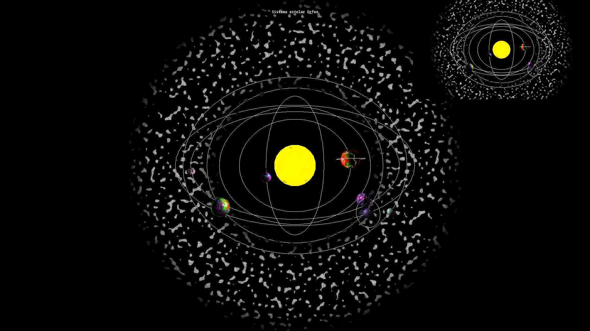

# Sistema estelar Orfeo 2: Electric Boogaloo

## Introducción

Orfeo ha sido golpeado por una catástrofe de dimensiones cataclísmicas.
Un enorme meteoro ha colisionado con la estrella y sus fragmentos, ahora
asteroides, orbitan atravesando los planetas exteriores.
¿Se recuperará Orfeo de este descalabro?

## Campo de asteroides
El campo de asteroides se ha creado usando un umbral sobre el ruido de Perlin por
gradiente. Además, la zona externa a los «asteroides» se ha marcado como transparente.
Además se han utilizado las fronteras de un diagrama de Voronoi generado automáticamente
(fuertemente inspirado en uno de los ejemplos del Libro de los Sombreadores), generando
unas «rajas» que pretenden simular fracturas en los asteroides para que se parezcan más
a rocas que a manchas. También se les ha añadido una velocidad angular para que orbiten
a un ritmo distinto del resto de planetas. La constante SCALE del sombreador de fragmento
puede usarse para alterar el número de asteroides y su tamaño.