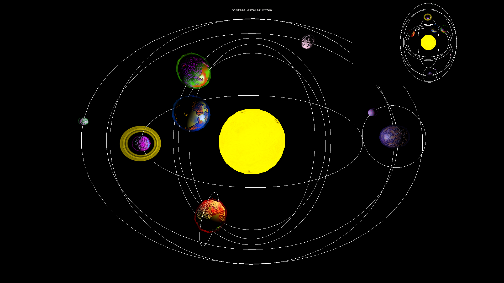

# Sistema estelar Orfeo

## Introducción

Este sistema estelar, bautizado como Orfeo, implementa de manera general lo visto en las
lecciones de visión por computador con las siguientes adiciones:

## Generación procedural
Valores aleatorios para el radio, la posición y demás propiedades de los planetas
se han usado para generar variedad, teniendo en cuenta que cada planeta
estará más lejos de la estrella del sistema que el anterior.  
El [generador de texturas de planetas de Rye Terrell](http://wwwtyro.github.io/procedural.js/planet1/),
sirvió para dar vida a la superficie y atmósfera de los planetas.
Se tuvo especial cuidado con entre otros el parámetro de la altura de los océanos para
asegurar que todos los planetas fueran interesantes y únicos.  
El generador provee de un mapa normal pero no de un mapa de deformaciones locales
para el planeta, así que con el ánimo de usar este tipo de mapa visto en la asignatura
se trataron estos mapas normales en el editor gráfico GIMP mediante un filtro
de Sobel en color y una posterior conversión a mapa de grises.  
Para simplificar el uso de texturas el parámetro que se pasa en la creación
de los planetas y las lunas es el índice, con lo que para añadir un
nuevo planeta bastaría con crear las texturas, guardarlas en la carpeta "Pi" (siendo i
el índice del íesimo planeta añadido) e incrementar en uno el número de planetas a
generar en el bucle.

## Visión otrográfica
Con el objetivo de hacer al segundo punto de vista más útil, se superpuso en la esquina
superior derecha del principal y se usó una cámara ortográfica para realizar una
proyección de la planta del sistema que también se actualizara en tiempo real,
para facilitar mantener la orientación durante el desplazamiento a través del sistema.

## Anillos, nubes, rotación e inclinación
Para dotar de mayor dinamismo y realismo al sistema se añadión una velocidad de giro
sobre su propio eje (que además puede estar inclinado con respecto al ecuador de la
estrella), del mismo modo que su satélite puede estarlo.  
Además, las nubes de los planetas (y lunas) giran con una velocidad de giro adicional
a la propia del planeta.  
Incluso se ha añadido un planeta con anillos y rotación a la propia estrella de Orfeo.  

### Notas
- Emplear las flechas de dirección para desplazar la cámara.